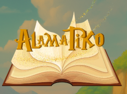

# Alamatiko

A mobile application featuring Filipino Folktales, Alamat (Legends), and Epiko (Epics) designed to encourage reading among children and preserve Filipino cultural heritage.


---

## About the Project

**Alamatiko** is a mobile application dedicated to preserving Filipino culture by making traditional folktales, legends (Alamat), and epics (Epiko) accessible to children through modern technology. The app combines cultural education with engaging storytelling to keep Filipino heritage alive for future generations.

### Mission

- **Cultural Preservation**: Digitally archive Filipino folklore and legends
- **Encourage Reading**: Make reading fun and engaging for children
- **Educational Value**: Teach Filipino values and history through stories
- **Accessibility**: Bring cultural content to everyone, anytime, anywhere

---

## Logo

### Logo

*Browse collections of Alamat and Epiko*

---

## Key Features

### Rich Story Collection

- **Alamat (Legends)**: Traditional Filipino origin stories
- **Epiko (Epics)**: Heroic tales from different regions

### Engaging Design

- **Beautiful Illustrations**: Filipino-inspired artwork
- **Kid-Friendly Interface**: Easy navigation for young readers
- **Colorful Visuals**: Eye-catching designs to maintain interest
- **Readable Fonts**: Age-appropriate text sizing

### Interactive Features

- **Audio Narration**: Listen to stories being read aloud (coming soon)

---

## Built With

- **Platform**: Android
- **Language**: Java
- **UI Framework**: XML Layouts
- **IDE**: Android Studio
- **Design**: Material Design Components

---

## Getting Started

### Prerequisites

- Android Studio (latest version)
- Android SDK (API level 21 or higher)
- Physical Android device or emulator
- Java Development Kit (JDK)

### Installation

1. **Clone the repository**
   ```bash
   git clone https://github.com/YOUR_USERNAME/Alamatiko.git
   ```

2. **Open in Android Studio**
   - File → Open
   - Select the Alamatiko folder
   - Wait for Gradle sync

3. **Build the project**
   - Build → Make Project
   - Wait for build to complete

4. **Run on device/emulator**
   - Connect Android device or start emulator
   - Click Run button (Shift + F10)

---

## Featured Stories

### Popular Alamat (Legends)

- **Alamat ng Pinya** - The Legend of the Pineapple
- **Alamat ng Ampalaya** - The Legend of Bitter Melon
- **Alamat ng Mangga** - The Legend of Mango
- **And More..**

### Epic Tales (Epiko)

- **Biag ni Lam-ang** - Life of Lam-ang (Ilocano)
- Continues to grow with updates!

---

## Design Philosophy

### Child-Centered Design

- Large, easy-to-tap buttons
- Simple navigation
- Colorful and inviting interface
- Age-appropriate content presentation

### Cultural Authenticity

- Traditional Filipino art styles
- Authentic story retellings
- Respectful cultural representation
- Regional diversity

---

## Educational Impact

### Learning Outcomes

Children who use Alamatiko will:

- Learn about Filipino culture and history
- Improve reading comprehension
- Understand Filipino values and morals
- Appreciate their cultural heritage
- Develop interest in reading
- Learn regional diversity of the Philippines

### For Parents & Teachers

- Supplement Filipino subject lessons
- Teach children about Philippine history
- Encourage reading habits
- Share cultural knowledge across generations

---

## Future Enhancements

Planned features for upcoming versions:

- [ ] Audio narration for each story
- [ ] Interactive animations
- [ ] Quiz mode for comprehension testing
- [ ] User-submitted stories (with moderation)
- [ ] Offline reading mode
- [ ] Multiple language support (Tagalog, English, regional languages)
- [ ] Coloring book feature
- [ ] Story of the day notifications
- [ ] Share stories with friends
- [ ] Achievement badges for reading milestones

---

## 🎓 Academic Context

- **Course**: Mobile Application Development
- **Institution**: Camarines Norte State College
- **Program**: BS Information Technology
- **Purpose**: Cultural preservation through technology
- **Academic Year**: 2024

---

## Known Issues

- Some older devices (Android 5.x) may experience slower loading
- Large images may take time on slow connections

Report bugs: [GitHub Issues](https://github.com/YOUR_USERNAME/Alamatiko/issues)

---

## Contributing

We welcome contributions!

### How to Help

- **Content**: Submit new Filipino stories
- **Translations**: Help translate to regional languages
- **Artwork**: Contribute Filipino-inspired illustrations
- **Code**: Bug fixes and feature improvements
- **Testing**: Report bugs and suggest improvements

---

## 👤 Author

**Emilyn B. Tagaan**

- **Program**: BS Information Technology
- **Specialization**: Frontend UI Design
- **Passion**: Game Development & Cultural Preservation
- GitHub: [@YOUR_USERNAME](https://github.com/emilyntagaan)
- LinkedIn: [Emilyn Tagaan](https://www.linkedin.com/in/emilyn-tagaan-8138003b0/)
- Email: emilyntagaan18@gmail.com

---

## Acknowledgments

- Filipino storytellers and cultural historians
- National Commission for Culture and the Arts (NCCA)
- Camarines Norte State College IT Department
- Beta testers (especially children and parents!)
- Filipino folklore researchers
- Family members who shared traditional stories

---

## Story Sources

Stories in this app are based on:

- Published Filipino folklore collections
- Traditional oral narratives
- Historical documents
- Regional cultural centers
- Academic research on Philippine literature

All content respects cultural heritage and is used for educational purposes.

---

## Cultural Note

Filipino folklore represents the rich cultural tapestry of the Philippines. Through Alamatiko, we honor these stories and the traditions they represent. We encourage readers to learn, share, and keep these cultural treasures alive.

**Mabuhay ang Kulturang Pilipino!** 🇵🇭
*(Long live Filipino culture!)*

---

## License

This project is for educational purposes. Cultural content is credited to original sources where known.

---

## Contact

Questions, suggestions, or story submissions:

- **Email**: emilyntagaan18@gmail.com
- **LinkedIn**: [Emilyn Tagaan](https://www.linkedin.com/in/emilyn-tagaan-8138003b0/)
- **Facebook**: [@emilyn.lennn](https://www.facebook.com/emilyn.lennn)
- **Instagram**: [@emilyyynnnnn](https://www.instagram.com/emilyyynnnnn/)

---

## Show Your Support

If you appreciate this app or Filipino culture:

- Give the project a star ⭐
- Share with Filipino families
- Contribute stories from your region
- Help preserve our cultural heritage

---

## 📊 Impact Statistics

- **Target Audience**: Children ages 7-12
- **Stories Available**: 30+ (and growing!)
- **Regions Covered**: Luzon, Visayas, Mindanao
- **Languages**: Filipino/Tagalog
- **Educational Level**: Elementary

---

**Preserving Filipino Heritage Through Technology 🇵🇭📱**

*Created with ❤️ for Filipino children and culture by Emilyn B. Tagaan*

*"Ang hindi marunong lumingon sa pinanggalingan ay hindi makararating sa paroroonan."*
*(One who does not look back to where they came from will not reach their destination.)*
